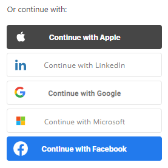

# BreadButter JavaScript
The official BreadButter JavaScript client library.

## Download
    https://cdn.breadbutter.io/dist/breadbutter.6.7.0.854.min.js
    
## Configuration

- Prior to coding, some configuration is required at https://app.breadbutter.io/app/#/app-settings. Make sure you add your website url to the CORS Allow List.
- For the full Developer Documentation please visit: https://breadbutter.io/api

---

## Integrate with BreadButter with one simple front end script tag

- `APP_ID` can be found in [App Settings](https://app.breadbutter.io/app/#/app-settings)

### Example Website
```html
<!DOCTYPE html>
<html>
  <head>
    <title>Bread & Butter Sample</title>
    <script>
        window.initBreadButter = function() {
            BreadButter.configure({ app_id: APP_ID });
            BreadButter.widgets.continueWith();
        };
    </script>
    <script id="breadbutter-js" src="https://cdn.breadbutter.io/dist/breadbutter.6.7.0.854.min.js"></script>
  </head>
 <body></body>
</html>
```

### Continue with script tag

Inject this on your home page to get started using with Bread & Butter with the Continue With widget.

```javascript
<script>
    window.initBreadButter = function() {
    	BreadButter.configure({ app_id: APP_ID });
    	BreadButter.widgets.continueWith();
    };
    (function(d, s, id){ var js,fjs=d.getElementsByTagName(s)[0]; if(d.getElementById(id)) {return;} js = d.createElement(s); js.id = id; js.src = 'https://cdn.breadbutter.io/dist/breadbutter.6.7.0.854.min.js'; fjs.parentNode.insertBefore(js, fjs); }(document, 'script', 'breadbutter-js'));
</script>
```

## Configure the global BreadButter client

```javascript
BreadButter.configure({
    app_id,
    api_path,
    destination_url,
    callback_url,    
    client_data,
    force_reauthentication, //default false
    app_name,
    page_view_tracking, //default true
    button_theme,
    continue_with_position: {
        top/bottom,
        left/right
    },
    expand_email_address, //default true
    show_login_focus, //default true
    allow_sub_domain, //default true
    remember_close, //default true
    success_event_code
});
```

#### Configuration Details
Property | Description
--- | ---
app_id | [STRING] Unique identifier for your application. Find your app_id here: https://app.breadbutter.io/app/#/app-settings.
callback_url | [STRING] The Callback URL is the URL that the user will be redirected to after they have authenticated with the provider. Please add your Callback URL by going to "Settings" in the left menu of your Bread & Butter app, and expand "Advanced Settings". Note that "Enable Callback URL" will need to be set to ON.
destination_url | [STRING] The Destination URL is the final destination for the user to be redirected. This is only required if your client side needs to tell your backend where to redirect the user.
app_name | [STRING] Application name that you want  displayed in the JSL widgets.
client_data | [OBJECT] Client data is used to allow you to pass parameters from the client side to your backend which processes the authentication.
force_reauthentication | [STRING] [off/attempt/force] Force reauthentication for the provider when your user logs in (ie, disregard the user's current session if the providers supports it).
page_view_tracking | [BOOLEAN] [DEFAULT: true] By default, the JSL will create events for all your user's page views. This parameter allows you to disable this feature.
button_theme| [STRING] [VALUES: round-icons/square-icons/tiles] [DEFAULT: 'tiles'] This parameter allows you to change the theme the provider buttons are displayed in your widgets.
expand_email_address | [BOOLEAN] [DEFAULT: true] This parameter is used to expand the email address field on advanced discovery.
show_login_focus | [BOOLEAN] [DEFAULT: false] Show the background blur for the continue with login on the advanced discovery.
continue_with_position | [OBJECT] [Example: {'top': '10px', 'right': '10px'}] Used for positioning the continue with widget. Will accept only 1 parameter for top/bottom and 1 parameter for left/right. Accepts 10, '10px', and '10%' for positioning.
allow_sub_domain | [BOOLEAN] [DEFAULT: false]
remember_close | [BOOLEAN] [DEFAULT: false]
success_event_code | [STRING] When authentication is a success, an event will be created with this custom event code.


## Widgets

### Continue With Widget


#### Global Overrides 
Accepted global options (defined above) when using the Continue With widget:
```
app_name
destination_url
callback_url
client_data
force_reauthentication
button_theme
continue_with_position
expand_email_address
show_login_focus
remember_close
success_event_code
```

#### Parameters
Property | Description
--- | ---
mode | [STRING] Used to start the widget in a specific part of the workflow.
email_address | [STRING] Used to prefill the email address for the user if you already have it (ie, querystring parameter from an email)
pin | [STRING] This parameter takes a pin sent to the user in a one of the following workflows: Email confirmation, Invitation, Reset Password.
onFormClose | [FUNCTION] Function called when the Continue With widget is closed.

#### Basic Usage
```
BreadButter.widgets.continueWith();

BreadButter.widgets.continueWith({
    email_address: USER_EMAIL
});

BreadButter.widgets.continueWith({
    mode: BreadButter.mode.RESET_PASSWORD,
    email_address: USER_EMAIL,
    pin: EMAIL_PIN
});

BreadButter.widgets.continueWith({
    mode: BreadButter.mode.CONFIRM_EMAIL,
    email_address: USER_EMAIL,
    pin: EMAIL_PIN
});

BreadButter.widgets.continueWith({
    mode: BreadButter.mode.INVITATION,
    email_address: USER_EMAIL,
    pin: EMAIL_PIN //if invitation pin is available
});
```

#### Close Event

```
BreadButter.widgets.continueWith();

BreadButter.widgets.continueWith({
    onFormClose: function() {
        console.log("Continue With widget dismissed");
    }
});
```

### Sign in Widget

 

#### Global Overrides 
Accepted global options (defined above) when using the Continue With Widget:
```
app_name
destination_url
callback_url
client_data
force_reauthentication
button_theme
expand_email_address
success_event_code
```

#### Parameters
Property | Description
--- | ---
mode | [STRING] Used to start the widget in a specific part of the workflow.
email_address | [STRING] Used to prefill the email address for the user if you already have it (ie, querystring parameter from an email)
pin | [STRING] This parameter takes a pin sent to the user in a one of the following workflows: Email confirmation, Invitation, Reset Password.

#### Basic Usage
```
BreadButter.widgets.signIn(TARGET_DOM_ID);

BreadButter.widgets.signIn(TARGET_DOM_ID, {
    email_address: USER_EMAIL
});

BreadButter.widgets.signIn(TARGET_DOM_ID, {
    mode: BreadButter.mode.RESET_PASSWORD,
    email_address: USER_EMAIL,
    pin: EMAIL_PIN
});

BreadButter.widgets.signIn(TARGET_DOM_ID, {
    mode: BreadButter.mode.CONFIRM_EMAIL,
    email_address: USER_EMAIL,
    pin: EMAIL_PIN
});

BreadButter.widgets.signIn(TARGET_DOM_ID, {
    mode: BreadButter.mode.INVITATION,
    email_address: USER_EMAIL,
    pin: EMAIL_PIN //if invitation pin is available
});
```

### Buttons Widget

#### Buttons


```
BreadButter.widgets.buttons(TARGET_DOM_ID);
```

#### Icons

```
BreadButter.widgets.buttons(TARGET_DOM_ID, {
    button_theme: ‘round-icons’
});
```

### De-identification
```
BreadButter.widgets.deIdentification();
```

## Methods

### Custom API Events
 

Use this method to track specific events performed by your users.

```
BreadButter.events.custom(CUSTOM_API_EVENT_NAME, function() {
    console.log(‘EVENT CALL COMPLETE’);
});
```

### Get Profile API

Use this method to retrieve user profile information about your users.

```
BreadButter.getProfile(function(user_profile, suggested_provider, device_verified) {
    console.log(‘GET PROFILE CALL COMPLETE’);
});
```

#### Response
Property | Description
--- | ---
user_profile | [OBJECT] Contains information identifying the users including: email_address, first_name, last_name, profile_image_url.
suggested_provider | [STRING] Type of account the user had logged in with (eg, Google, Linkedin, Microsoft, etc.)
device_verified | [BOOL] Whether the user is verified or not.
